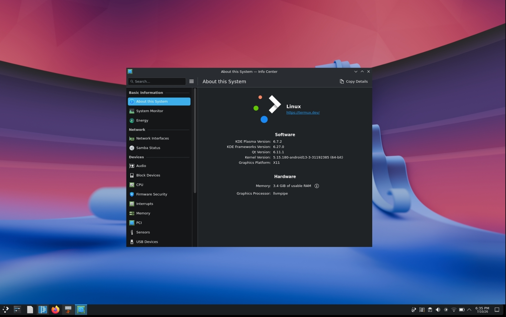

KDE Plasma 6 on Termux

«A guide to installing KDE Plasma 6 natively on Termux using the official "x11-packages" repository.»

«Note: This guide installs KDE Plasma directly in Termux. It does not require a Linux distribution running in "proot-distro".»

---

Requirements

- Android 10 or newer (recommended)
- Latest version of Termux
- At least 3 GB of free storage
- Internet connection

---

Update Termux

Update all installed packages before proceeding.

pkg update && pkg upgrade -y

---

Enable the X11 Repository

Install the X11 repository:

pkg install x11-repo

Update the package lists:

pkg update

---

Install KDE Plasma

Install the Plasma desktop environment:

pkg install plasma

This metapackage installs the KDE Plasma desktop along with its required dependencies.

---

Install Recommended KDE Applications (Optional)

pkg install \
dolphin \
konsole \
kate \
gwenview \
spectacle \
systemsettings \
kdeconnect

Additional KDE applications available in the repository include:

- Kdenlive
- KTorrent
- Elisa
- KCalc
- KFind
- KWeather
- Konqueror
- Calligra
- Cantor

---

Verify the Installation

Check that the main Plasma packages are installed:

pkg list-installed | grep plasma

Example output:

plasma
plasma-desktop
plasma-workspace

---

Start KDE Plasma

If your installation provides "startplasma-x11":

startplasma-x11

Otherwise, check which executable is available:

which startplasma
which startplasma-x11

If "startplasma" exists, run:

startplasma

---

Running Plasma with VNC

Edit the VNC startup script:

~/.vnc/xstartup

Example:

#!/data/data/com.termux/files/usr/bin/sh

export XDG_SESSION_TYPE=x11
export DESKTOP_SESSION=plasma
export XDG_CURRENT_DESKTOP=KDE
export KDE_FULL_SESSION=true

exec startplasma-x11

Make the script executable and restart the VNC server:

chmod +x ~/.vnc/xstartup

vncserver -kill :1
vncserver :1

---

Updating KDE Plasma

Keep your installation up to date:

pkg update
pkg upgrade

---

Uninstall

Remove KDE Plasma:

pkg uninstall plasma

Remove unused dependencies:

pkg autoremove

---

Troubleshooting

"startplasma-x11" not found

Check which Plasma startup command is installed:

which startplasma
which startplasma-x11

---

Black screen after launching Plasma

- Make sure your X11 server or VNC server is running.
- Verify that all Plasma dependencies are installed.
- Check the session log for errors.

---

KDE applications do not start

Make sure:

- "x11-repo" is enabled.
- Your packages are fully updated.
- All required Qt and KDE Frameworks packages are installed.

---

License

This document is released under the MIT License. Feel free to copy, modify, and distribute it.
